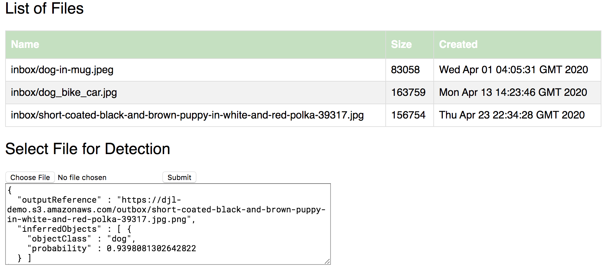

**Work in progress**

## Abstract 

*Many AWS customers (startups and large enterprises) are on their path to adopt machine learning and deep learning in their existing applications. The reasons for machine learning adoption are dictated by the pace of innovation in the industry and business use cases range from customer service (including object detection from images and video streams, sentiment analysis) to fraud detection and collaboration. However, until recently, the adoption path was quite steep and required development of internal technical expertise in new programming languages (e.g. python) and frameworks with cascading effect on the whole software development life-cycle, including coding, building, testing, deployment. The approach outlined in this blog post enables enterprises to leverage existing talent and resources (frameworks, pipelines, deployments) to integrate machine learning capabilities.*


## 1. Introduction

Spring boot, one of the most popular and wide-spread frameworks for microservices development, has simplified implementation of distributed systems. Despite its broad appeal, there are few options to easily integrate Machine Learning (ML) natively in Java. Existing solutions such as stock APIs often do not meet customized application requirements, and developing customized solutions is time consuming and not cost-effective. 

There are a number of ways how developers approached integration of machine learning capabilities in existing applications. Let’s take inference for example: current options vary from using stock API to having a Python or C++ based application wrapped with an API for remote calls. However, stock API while having robust models may not quite fit your domain or industry, causing defects discovered in production with few options to address them. In other cases, when running inference at scale (for example in streaming applications as well as latency sensitive microservices) making a remote call may not be a viable option due to performance reasons.  

Recognizing this challenge, we at AWS have created a few open-source projects to facilitate adoption of ML for Java and microservices and ultimately help our customers, partners and the open source community as a whole. These initiatives align closely with the AWS goal to take technology that was traditionally cost-prohibitive and difficult for many organizations to adopt, and make it accessible to a much broader audience.

In this blog post we will demonstrate how Java users can integrate ML into their Spring applications with Spring
 Boot Starter for Deep Java Library (DJL). 

Together we will review how to apply these frameworks in action and integrate ML capabilities in a microservice, demonstrating common deep learning use cases around object detection and classification.

## 2. DJL Overview

Deep Java Library (DJL) is an open-source, high-level, framework-agnostic Java API for deep learning. DJL is designed to be easy to get started with and simple to use for Java developers. DJL provides a native Java development experience and functions like any other regular Java library.

DJL provides a convenient abstraction layer to use the most popular AI/ML frameworks such as MXNet, PyTorch and TensorFlow. However, it is not just a convenience on top of the existing libraries some of which provide Java API / bindings. With DJL API you are getting a uniform and consistent layer that can interact with all of these frameworks, allowing to swap out the framework of choice without any impact to the client code.

This unique features in combination with a fairly rich model zoo repository (repository with pre-trained models), can enable ML engineers to find optimal models for the task at hand regardless of the underlying model implementation. 

For more information on DJL please refer to the  [DJL GitHub Repository](https://github.com/deepjavalibrary/djl/) and [FAQ](https://github.com/deepjavalibrary/djl/blob/master/docs/faq.md).


## 3. DJL Spring Boot Starter

What is Spring Boot Starter (or custom starter)? Spring Boot Starter is a one-stop shop for all the Spring and related technologies that you need without having to hunt through sample code and copy-paste loads of dependency descriptors. Please see the [official Spring Boot documentation](https://docs.spring.io/spring-boot/docs/2.2.2.RELEASE/reference/htmlsingle/#using-boot-starter) for more information on the starters.

Following this definition, DJL Spring Boot Starter provides all the dependencies required to start using DJL in Spring as a single artifact. In addition to the dependency management, starter includes an [auto-configuration](https://docs.spring.io/spring-boot/docs/current/reference/html/spring-boot-features.html#boot-features-developing-auto-configuration) that allows to automatically wire dependencies based on the configuration file supplied by the user and make them available as beans in the Spring Application context. 

### 3.1 Dependency Management

DJL library is platform specific, however it provides ways to automatically look up correct dependency based on the target OS. Along with that, DJL may be configured with different underlying engines, such as MXNet, PyTorch and TensorFlow, so the user is expected to make this choice before the starter is used. However, even after the choice is made, the underlying engine (as well as the target OS archticture) can be changed by just changing your maven (or gradle) dependency with no impact to your code. 

The starter dependency management is organized in a way that provides most flexibility to the user.
 
For MXNet starter the following OS classifiers are supported: `osx-x86_64` for Mac OSX, `linux-x86_64` for generic linux, `win-x86_64` for Windows distributions and `auto` for automatic detection of the target OS. The last option requires connectivity to the external artifact repository (e.g. Maven Central) at runtime, which may be an issue for systems with restricted egress. 

Below you can see an example of *MXNet Dependency for linux architecture*, which is optimal for container workloads:

```xml
  <parent>
    <artifactId>spring-boot-starter-parent</artifactId>
    <groupId>org.springframework.boot</groupId>
    <version>2.2.6.RELEASE</version>
  </parent>

  <properties>
    <java.version>11</java.version> <!-- 11 is the lowest supported java version, however 12 and 13 should work fine -->
    <jna.version>5.3.0</jna.version> <!-- Required to override default JNA version for Spring Boot parent-->
  </properties> 

  <dependency>
    <groupId>ai.djl.spring</groupId>
    <artifactId>djl-spring-boot-starter-mxnet-linux-x86_64</artifactId>
    <version>${djl.starter.version}</version> <!-- e.g. 0.2 -->
  </dependency>
```

`Auto` dependency that will download the correct artifact at runtime: <a id="maven-auto-dependency"></a>

```xml
  <dependency>
    <groupId>ai.djl.spring</groupId>
    <artifactId>djl-spring-boot-starter-mxnet-auto</artifactId>
    <version>${djl.starter.version}</version> <!-- e.g. 0.2 -->
  </dependency>
```

Using `PyTorch` as an underlying engine the starter dependency:

```xml
  <dependency>
    <groupId>ai.djl.spring</groupId>
    <artifactId>djl-spring-boot-starter-pytorch-auto</artifactId>
    <version>${djl.starter.version}</version> <!-- e.g. 0.2 and above -->
  </dependency>
```

Gradle dependencies will look similar. It is important to set the JNA version as `jna.version=5.3.0` inside your `gradle.properties`, since Spring Boot parent pom brings a lower version of JNA which will not work with the DJL starter. Here is an example of your gradle build file (kotlin is used in this example) `build.gradle.kts`, assuming Spring Boot plugin is registered:

```kotlin
  plugins {
    ...
    id("org.springframework.boot")
  }

  repositories {
    mavenCentral() // released artifacts are available from maven central
  }

  dependencies {
    implementation("ai.djl.spring:djl-spring-boot-starter-mxnet-auto:0.2")
  }
```

### 3.2 Spring Auto-configuration

 Once dependencies are configured correctly in your Spring Boot application, the next step is to configure your beans and wire them properly for injection. It is fairly easy to configure DJL related beans and make them available in the Spring application context, but it requires internal knowledge of the library as well as peculiarities of individual classes for proper scoping, since some beans are thread-safe, others should be scoped per request/thread. To assist with this configuration, the DJL Spring Boot starter provides an [auto-configuration](https://docs.spring.io/spring-boot/docs/2.2.6.RELEASE/reference/html/using-spring-boot.html#using-boot-auto-configuration). 
 
 This component is separate from the dependency component and requires an explicit dependency. It is done for a couple of reasons:

 1. Some developers prefer full control over the configuration options and may be opposed to the Spring "auto magic". In such cases, the starter will support just basic set of dependencies and allow developers to wire components explicitly.
 2. Auto-configuration component is generic for all kinds of the DJL configuration. Regardless of the underlying target OS or the actual engine, the configuration component remains the same. So using the same auto-configuration, developers can swap underlying dependencies as a single step operation without any impact to the code. 

Declaring dependency on auto-configuration in maven:

```xml
  <dependency>
    <groupId>ai.djl.spring</groupId>
    <artifactId>djl-spring-boot-starter-autoconfigure</artifactId>
    <version>${djl.starter.version}</version>
  </dependency>
```

Or in gradle `build.gradle.kts`:

``` kotlin
  dependencies {
    implementation("ai.djl.spring:djl-spring-boot-starter-autoconfigure:${djl.starter.version}")
  }
```

Once the dependency is declared, the Spring Boot framework will automatically locate the configuration and wire the required components. At present, for inference it will look up the model from the model zoo and create a predictor that will be readily available to run inference. 

Users are expected to supply standard Spring configuration (`application.yml` or `application.properties`) specifying their application type and model filter parameters to look up the proper model to use:

```java
  QUESTION_ANSWER(NLP.QUESTION_ANSWER),
  TEXT_CLASSIFICATION(NLP.TEXT_CLASSIFICATION),
  IMAGE_CLASSIFICATION(CV.IMAGE_CLASSIFICATION),
  OBJECT_DETECTION(CV.OBJECT_DETECTION),
  ACTION_RECOGNITION(CV.ACTION_RECOGNITION),
  INSTANCE_SEGMENTATION(CV.INSTANCE_SEGMENTATION),
  POSE_ESTIMATION(CV.POSE_ESTIMATION),
  SEMANTIC_SEGMENTATION(CV.SEMANTIC_SEGMENTATION);
```

For example, in order to run object detection in images, user can set the application type to `OBJECT_DETECTION`. DJL related configuration should be namespaced under `djl` for example `djl.application-type=OBJECT_DETECTION` if `application.properties` is used. 

Example of `yaml` configuration for DJL auto-configuration <a id="yaml-example"></a>: 

```yaml
  djl:
    # Define application type
    application-type: OBJECT_DETECTION
    # Define input data type, a model may accept multiple input data type
    input-class: java.awt.image.BufferedImage
    # Define output data type, a model may generate different out put
    output-class: ai.djl.modality.cv.output.DetectedObjects
    # Define filters that matches your application's need
    model-filter:
      size: 512
      backbone: mobilenet1.0
    # Override default pre-processing/post-processing behavior
    arguments:
      threshold: 0.5 # Display all results with probability of 0.5 and above
```

### 3.3 IDE Support

Configuration creation does not have to be fully manual and DJL Spring Boot Starter provides configuration content assistant for most IDEs with the help of Spring IDE plugins (tested on IntelliJ IDEA, but expected to work in Eclipse with STS and NetBeans IDE).

For IntelliJ you can use `Ctrl+Space` for auto-completion and `Ctrl+J` for quick doc on any property. 

 
 

## 4. Simple Application Walkthrough

Code Example based on [Simple Spring Boot Application](https://github.com/deepjavalibrary/djl-spring-boot-starter/tree/master/djl-spring-boot-console-sample) demonstrate single shot object detection with DJL and MXNet.

Dependencies setup are per [maven dependency section](#maven-auto-dependency). Configuration setup is identical to the [`application.yml` in the example](#yaml-example).
The application is a regular console Spring Boot application with a single class (note that no other code is required). 

**Injecting predictor for object detection**

```java
  @Resource
  private Supplier<Predictor<BufferedImage, DetectedObjects>> predictorProvider;
```
It is recommended to use predictor in a `try-with-resources` block to make sure it is closed after each use, hence the supplier of predictor is injected for convenient instantiation. 

**Running object detection**

```java
  try (var predictor = predictorProvider.get()) {
      var results = predictor.predict(ImageIO.read(this.getClass()
            .getResourceAsStream("/puppy-in-white-and-red-polka.jpg")));

      for(var result : results.items()) {
          LOG.info("results: {}", result.toString());
      }
  }
```

The above code will run object detection on the supplied image (expected to be on the class path) and output the results to the logger in the following form:

```
    a.d.s.e.console.ConsoleApplication       : results: class: "dog", probability: 0.90820, bounds: [x=0.487, y=0.057, width=0.425, height=0.484]
```

**Building and running**

Assuming you have checked out the repository and are now in the root of the repository:

```bash
  > git clone git@github.com:deepjavalibrary/djl-spring-boot-starter.git 
  > cd djl-spring-boot-starter/djl-spring-boot-console-sample
  > ../mvnw package
  > ../mvnw spring-boot:run
```

Alternatively you can run it directly with `java -jar` command:

```
  java -jar target/djl-spring-boot-console-sample-0.20-SNAPSHOT.jar     
```

## 5. More Complex Application Example 

Code Examples based on [REST API example leveraging DJL Spring Boot Starter](https://github.com/deepjavalibrary/djl-spring-boot-starter-demo/tree/master/djl-spring-boot-app/) demonstrates a RESTful API that can take images from Amazon S3 bucket and stores the object detection results back in S3. This API represents a microservice capable of taking any image reference (uploaded to the predefined Amazon S3 bucket) and run object detection on it. This API could be leveraged directly through REST API clients like Postman, or within a mobile or web application. 

The API portion is using gradle as its build system and leverages Spring MVC for REST API implementation. For simplicity, the controller is implemented as a blocking call. For high-volume production usage, it is recommended to use reactive style of API implementation such as WebFlux. It contains an example of an [explicit programmatic configuration](https://github.com/deepjavalibrary/djl-spring-boot-starter-demo/blob/master/djl-spring-boot-app/src/main/java/com/aws/samples/djlspringboot/InferenceConfiguration.java) of DJL components in your Spring Boot Application.

The web application portion is implemented as a Kotlin Spring MVC application with a reactive REST API client to invoke the backend API. 

The user is presented with a list of files and an option to select any file for upload and object detection, the API output is displayed directly below:



The result of the object detection is applied back to the image, highlighting the areas where objects were detected and uploaded to S3:


 
In subsequent posts, we will review how to containerize these applications and organize a full CI/CD pipeline deploying to Amazon Elastic Kubernetes Service. 

## 6. Conclusion

Adopting machine learning with DJL and Spring Boot is a simple and powerful approach that enables customers to combine existing battle-tested microservice technology stack and the most proven deep learning frameworks like MXNet, PyTorch and Tensorflow through the convenient abstraction layers provided by DJL and Spring Boot.  

## 7. References

[DJL Spring Boot Starter](https://github.com/deepjavalibrary/djl-spring-boot-starter) - Spring Boot starter that allows Spring Boot developers to start using DJL for inference
 
[DJL Spring Boot Demo](https://github.com/deepjavalibrary/djl-spring-boot-starter-demo) - Demo repository containing java API that leverages the starter and gradle as well as a small kotlin-based web application
 
[DJL](https://github.com/deepjavalibrary/djl/) - DJL (Deep Java Library) main repository 
 
